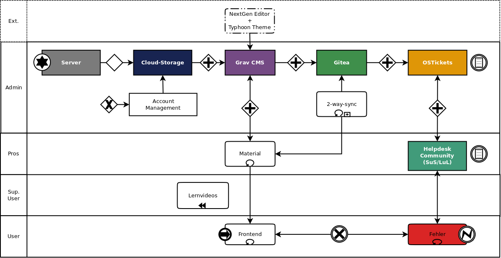

Ein ungelöstes Problem in der Erstellung von Materialien für den Schulunterricht, ist die langfristige _Maintenance_. Viele Lehrerinnen haben eine große Anzahl von Dateien, die früher oder später _out of date_ sind oder aber Fehler enthalten, die über Jahre hinweg möglicherweise nicht adressiert werden. Um diese Art und Weise der lehrerzentrierten Materialerstellung zu verändern, möchte ich hier ein Beispiel mit GravCMS und Git vorstellen. 

===

Es gibt zahlreiche Möglichkeiten, um die hier vorgestellte Variante der Materialerstellung zu realisieren. Ich habe mich für GravCMS entschieden, da es aus meiner Perspektive die beste _authoring experience_ hat. 

Materialien sind oft direkt im schulischen Cloud-Storage als PDF oder in Moodle Kursen als PDF, selten aber als echtes Webmaterial zu finden ist. Eine Vermutung, die sich mir in den letzten Jahren immer mehr aufdrängt ist, dass ein geordneter Prozess für die Erstellung von Materialien geschaffen werden muss, der eine langjährige Entwicklung in Augenschein nimmt. Programmierer im Bereich der OpenSource Entwicklung machen dies oft, indem Sie Repositories eröffnen, in denen alle Prozesse der Veränderung festgehalten, erlaubt, abgelehnt und oder Änderungsvorschläge diskutiert werden. Ein Repository erlaubt es auch geklont und auf Basis seiner Lizenz verändert zu werden, gleichzeitig aber, wenn gewünscht, von Veränderungen des geklonten Repositories zu erben. Übertragen auf Materialien in der Schule bedeutet dies, dass man bei einer langfristig angelegten Planung von Materialpools in Schulen ein System schaffen kann, das einen so genannten _main branch_ (Hauptzweig) zusammen über eine Fachkonferenz für das Fach und bestimmte Jahrgänge pflegt, d.h. also ein Basis-Material für alle Kolleginnen zur Verfügung stellt, welches daraufhin aber kopiert und verändert werden kann, d.h. also weitere Zweige vom _main branch_ bilden kann.

Diese Arbeitsweise ist nicht unbekannt, allerdings in der Schule auf technischer Ebene selten oder nie angekommen. Hier arbeiten Individuen oft aneinander vorbei, da individuelle Herangehensweisen an Themen im Vordergrund stehen. Dies kann im Rahmen der Bearbeitung mit Grav und Git auch weiter so geschehen, da ja nur vom _main branch_ geerbt wird. Eine Einigung ist also nur auf Ebene der Fachkonferenz nötig. 

